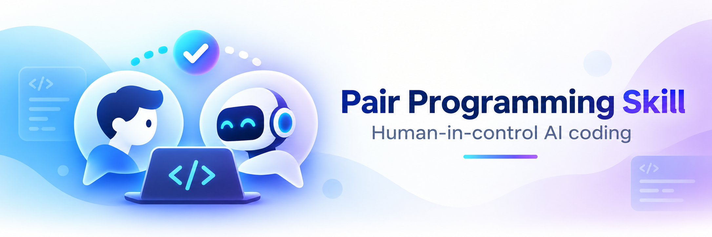

# Pair Programming Skill

**English** | [Simplified Chinese](README.zh-CN.md)

<p align="center">
  
</p>

> Let AI prove the feature in an isolated workspace first, then guide you through rebuilding it step by step until the code is something you understand, can maintain, and are confident changing.

Modern coding agents no longer struggle mainly with *writing* code. The new problem is:

> **AI coding speed is starting to exceed human comprehension speed.**

If an agent changes dozens of files and generates thousands of lines in one pass, the result may compile and all tests may pass, yet you can still lose ownership of the code very quickly.

Pair Programming Skill does not try to make AI weaker. It changes the division of labor:

- AI first explores, implements, builds, tests, and debugs the complete feature in a **Shadow Workspace**.
- If the request is not already an implementation-ready design, AI first writes a design and waits for user approval.
- Once the Shadow solution is verified, AI reverse-decomposes it into human-sized implementation steps.
- The real Human Workspace remains under user control.
- The user can ask for hints, explanations, reference code, review, or selective AI takeover at any time.
- Pitfalls discovered during Shadow implementation are preserved and proactively taught during the guided reconstruction.

Core principle:

> **AI coding throughput <= Human comprehension throughput**

---

## Installation

### Recommended: ask your coding agent to install it

Copy this prompt to Codex, Claude Code, Cursor, OpenCode, Gemini CLI, or GitHub Copilot:

> Install Pair Programming Skill from this repository:
> https://github.com/CPythoner/pair-programming-skill
>
> Detect which coding agent you are running in and install the skill to the recommended
> location for that host.
>
> Prefer the shared `.agents/skills/pair-programming/` location when the host supports it.
> Otherwise use the host-native skill directory.
>
> Do not overwrite an existing installation without asking me first.
>
> After installation:
> 1. verify that `SKILL.md` and its supporting files are present;
> 2. tell me the actual installation path;
> 3. tell me whether I need to reload or restart the agent;
> 4. show me how to start Pair Programming Skill.

This is the preferred installation path because the agent can inspect its own host,
choose the right discovery directory, and verify the result.

### Install from terminal

For a shared portable installation:

```bash
git clone https://github.com/CPythoner/pair-programming-skill.git
cd pair-programming-skill
bash scripts/install.sh portable
```

This installs to:

```text
.agents/skills/pair-programming/
```

For a user-level shared install:

```bash
bash scripts/install.sh portable --scope user
```

Windows PowerShell:

```powershell
git clone https://github.com/CPythoner/pair-programming-skill.git
cd pair-programming-skill
.\scripts\install.ps1 portable
```

### Platform-specific installation

Use a host-aware target when you do not want the shared portable location:

```bash
bash scripts/install.sh codex
bash scripts/install.sh cursor
bash scripts/install.sh gemini-cli
bash scripts/install.sh github-copilot
bash scripts/install.sh claude-code
bash scripts/install.sh opencode
```

Cursor, Gemini CLI, and GitHub Copilot also support host-native directories:

```bash
bash scripts/install.sh cursor --native
bash scripts/install.sh gemini-cli --native
bash scripts/install.sh github-copilot --native
```

PowerShell:

```powershell
.\scripts\install.ps1 cursor -Native
.\scripts\install.ps1 gemini-cli -Native
.\scripts\install.ps1 github-copilot -Native
```

Install into another repository with `--target /path/to/repo` (Bash) or
`-Target C:\path\to\repo` (PowerShell).

Existing installations are not overwritten unless `--force` / `-Force` is explicitly
supplied.

### Supported hosts

| Host | Default project path | Default user path | Explicit activation |
|---|---|---|---|
| Portable Agent Skills | `.agents/skills/pair-programming/` | `~/.agents/skills/pair-programming/` | Host-dependent |
| Codex | `.agents/skills/pair-programming/` | `~/.agents/skills/pair-programming/` | `$pair-programming plan ...` |
| Cursor | `.agents/skills/pair-programming/` | `~/.agents/skills/pair-programming/` | `/pair-programming plan ...` |
| Gemini CLI | `.agents/skills/pair-programming/` | `~/.agents/skills/pair-programming/` | Activate the skill, then provide `/pair ...` intent |
| GitHub Copilot | `.agents/skills/pair-programming/` | `~/.agents/skills/pair-programming/` | Ask to use `/pair-programming` |
| Claude Code | `.claude/skills/pair-programming/` | `~/.claude/skills/pair-programming/` | `/pair-programming plan ...` |
| OpenCode | `.opencode/skills/pair-programming/` | `~/.config/opencode/skills/pair-programming/` | `/pair-programming plan ...` |

See [adapters/README.md](adapters/README.md) for host-specific details.

### Validate the package

```bash
python3 scripts/validate-package.py
```

---

## Why this exists

A typical autonomous coding-agent workflow looks like this:

```text
Requirement
    ↓
Agent
    ↓
Large code change
    ↓
Tests pass
    ↓
"Looks fine"
    ↓
A few weeks later:
"I no longer feel safe changing this code."
```

Pair Programming Skill changes the workflow to:

```text
Requirement / Design
        ↓
Design Gate
        ↓
Shadow Implementation
        ↓
Build / Test / Debug
        ↓
Record Pitfalls & Hidden Constraints
        ↓
Reverse Decomposition
        ↓
Guided Reconstruction
        ↓
AI Review / Hint / Explain
        ↓
Selective AI Takeover when useful
        ↓
Code you can actually maintain
```

The Shadow Workspace is the route AI has already flown once.

The Human Workspace is the code that ultimately matters.

---

## Core architecture

The workflow has four major layers:

```text
┌────────────────────────────────┐
│ 1. Design Gate                 │
│ Turn a goal into a concrete    │
│ implementation-ready design    │
└───────────────┬────────────────┘
                ↓
┌────────────────────────────────┐
│ 2. Shadow Workspace            │
│ AI fully implements, validates │
│ and discovers pitfalls         │
└───────────────┬────────────────┘
                ↓
┌────────────────────────────────┐
│ 3. Guide Branch                │
│ Rebuild the verified solution  │
│ as teachable commits           │
└───────────────┬────────────────┘
                ↓
┌────────────────────────────────┐
│ 4. Human Workspace             │
│ The code the user actually     │
│ implements and owns            │
└────────────────────────────────┘
```

### Reliability model

The workflow also treats long-running AI work as recoverable engineering state:

- **Transactional takeover** — every `/pair take` records a checkpoint and durable operation journal before source modification.
- **Session recovery** — a new session reconciles `.pair/` metadata with actual Git state before continuing.
- **Versioned state** — structured YAML uses `schema_version: 1` with JSON Schemas under `schemas/`.
- **Contextual Pitfalls** — Pitfalls can match by step, file, symbol, platform, configuration, or condition.
- **Guide quality gate** — Guide commits are checked for linearity, scope size, stable step markers, and final-tree differences before reconstruction.

These rules are designed for features that may span multiple sessions and partial Human/AI ownership.

---

## 1. Design Gate — design before implementation

`/pair plan` does **not** always mean "start coding immediately."

If the user only provides a feature goal:

```text
/pair plan add automatic reconnect for remote MCP
```

that is a **Feature Goal**, not an implementation-ready design.

The agent first:

1. inspects the relevant existing code;
2. understands current interfaces, data flow, lifecycle, and constraints;
3. produces a concrete implementation design;
4. saves it to:

```text
.pair/design.md
```

5. records:

```yaml
design:
  source: ai_generated
  status: awaiting_approval
  revision: 1
  approved_revision: 0
```

Then it **stops**.

At this point it must not:

- create the Shadow worktree;
- create an implementation branch;
- edit production/source code;
- generate the full implementation.

Implementation starts only after explicit approval, for example:

```text
Approved. Implement this design.
```

### Approval is revision-scoped

Design approval is not permanent.

```text
revision 3
   ↓
user approves
   ↓
approved_revision = 3
   ↓
design changes materially
   ↓
revision 4
status = awaiting_approval
approved_revision = 0
```

A changed design must be approved again.

Implementation is allowed only when:

```text
design.status == approved
AND
design.approved_revision == design.revision
```

If `/pair plan` already includes a sufficiently concrete design, ADR, PRD, or design document, the Skill reads it, verifies that it is implementation-ready, normalizes/saves it as `.pair/design.md`, and may proceed directly to Shadow implementation unless the user explicitly asks for design review only.

---

## 2. Shadow Workspace — let AI walk the whole path first

After design approval, AI creates an isolated Git worktree for the Shadow solution:

```text
pair-shadow/<feature>/solution
```

Inside the Shadow Workspace, AI may:

- implement the complete feature;
- try alternative approaches;
- compile/build;
- run tests;
- debug;
- validate edge cases;
- add temporary instrumentation;
- discard failed approaches.

The Shadow Workspace does not replace the user's real working tree.

### Default worktree layout

```text
workspace/
├── my-project/
│   ├── .git/
│   │   └── worktrees/...          # Git-managed metadata
│   ├── .pair/                     # Pair Programming state
│   └── src/
│
└── .pair-worktrees/
    └── my-project/
        └── feature-name/
            └── shadow/            # Actual Shadow checkout
```

The Skill resolves Git paths using:

```bash
git rev-parse --show-toplevel
git rev-parse --git-common-dir
```

It does not assume `.git` is always a directory.

> The actual checked-out source tree does not live inside `.git`.  
> `.git/worktrees/*` is managed only by Git itself.

By default, each feature uses one physical Shadow checkout.

The verified complete implementation is preserved in:

```text
pair-shadow/<feature>/solution
```

The pedagogical commit chain is preserved in:

```text
pair-shadow/<feature>/guide
```

---

## 3. Pitfall Journal — Shadow failures become teaching material

The value of Shadow implementation is not only that AI reaches a working answer first.

It also discovers problems before the user does:

- incorrect assumptions;
- lifecycle bugs;
- concurrency traps;
- hidden API constraints;
- build and dependency surprises;
- platform-specific behavior;
- edge cases exposed only by tests;
- approaches that look reasonable but fail in practice.

That knowledge must not disappear after the final implementation passes.

Meaningful pitfalls are recorded in:

```text
.pair/pitfalls.yaml
```

Example:

```yaml
- id: P003
  title: Registry teardown order causes dangling provider references
  status: resolved
  severity: high
  category: lifetime

  symptom: Integration test crashes during Plugin destruction.

  wrong_assumption:
    Registry entries could outlive Plugin instances.

  root_cause:
    Registry does not own Provider lifetime.

  resolution:
    Remove capability registrations before Plugin destruction.

  related_steps:
    - plugin-lifecycle

  lesson_for_human:
    Registry entries must never outlive their Provider.

  avoidance:
    Always unregister before destroying Plugin.
```

### Pitfalls are surfaced proactively

When the user runs:

```text
/pair next
```

and the current step has a mapped Shadow pitfall, the agent must proactively explain it.

Example:

```text
Shadow pitfall P003

The first Shadow implementation called unregister after Plugin destruction,
which produced a dangling reference in integration tests.

Root cause:
CapabilityRegistry does not own Provider lifetime.

Invariant for this step:
unregister first, destroy Plugin second.
```

The user should not have to ask:

> "Did AI run into any problems here?"

`/pair review` also checks whether the Human implementation falls into a known Shadow pitfall.

Shadow therefore serves two purposes:

```text
Reference Implementation
        +
Pre-mortem / Pitfall Discovery
```

---

## 4. Reverse Decomposition — derive the learning path from a verified solution

After Shadow implementation is complete and verified, the Skill does not split the final diff mechanically by file.

This is a poor decomposition:

```text
Step 1 modify foo.h
Step 2 modify foo.cpp
Step 3 modify test.cpp
```

Instead, it decomposes by:

- dependency;
- concept;
- architecture;
- verification point.

Example:

```text
Step 1  Define Capability identity
        ↓
Step 2  Implement CapabilityRegistry
        ↓
Step 3  Integrate with PluginManager
        ↓
Step 4  Define lifecycle / concurrency rules
        ↓
Step 5  Add integration tests
        ↓
Step 6  Final verification
```

Default guidance for one step:

- one primary concept;
- roughly 1–3 files;
- around 150 effective diff lines;
- one explicit validation point.

Complex steps may exceed these limits when the change is logically cohesive.

---

## 5. Guide Branch — stable reference code for every step

After the full solution is verified, the Skill reconstructs the feature from the original baseline as a pedagogical commit chain:

```text
pair-shadow/<feature>/guide
```

Example:

```text
baseline
   │
   ├── Step 1 commit
   ├── Step 2 commit
   ├── Step 3 commit
   ├── Step 4 commit
   └── Step 5 commit
```

This makes:

```text
/pair show step 3
```

able to show the exact reference delta for Step 3.

And:

```text
/pair take step 3
```

can selectively transfer that logical unit rather than trying to infer it from one huge final diff.

The Guide Branch does not need to preserve Shadow's exploratory commit history.

Its goal is:

> **correct + verifiable + teachable**

Before guided reconstruction, the Guide is checked against the quality contract in
`reference/guide-quality.md`. `scripts/check-guide.py` can detect merge commits, oversized
steps, unstable commit markers, and final-tree differences from the Shadow solution.

---

## 6. Guided Reconstruction — the user stays in the driver's seat

The Human Workspace now rebuilds the feature deliberately.

Running:

```text
/pair next
```

shows only what is needed for the current step:

- Goal;
- Why;
- current code path;
- constraints and invariants;
- target files/symbols;
- validation command;
- relevant Shadow pitfalls;
- suggested first move.

The full reference implementation is not shown by default.

---

## Commands

These are **conversation protocol commands**. They do not require the host coding agent to register actual shell slash commands.

### `/pair plan <goal-or-design>`

Start a Pair Programming feature.

If the input is underspecified:

```text
Design
→ save .pair/design.md
→ wait for explicit approval
```

If an implementation-ready design is already provided:

```text
Normalize design
→ Shadow Implementation
→ Guide
```

---

### `/pair next`

Enter the next available Guide step.

Before the user writes code, AI explains:

- why this step exists;
- what should change;
- which invariants matter;
- what Shadow already discovered here;
- how to validate the result.

Then it stops at the human coding checkpoint.

---

### `/pair review [scope]`

Review the Human implementation semantically.

Priority:

```text
correctness
→ behavioral gap
→ regression
→ ownership / lifetime
→ error handling
→ concurrency
→ API compatibility
→ maintainability
→ style
```

Shadow is a secondary reference, not a mandatory answer.

If the Human implementation is simpler, fits the repository better, and satisfies the requirements, the Skill should keep the Human design and adapt later steps.

---

### `/pair hint [scope] [level]`

Progressive assistance:

```text
Level 1  Conceptual hint
Level 2  API / data structure / control-flow hint
Level 3  Pseudocode / skeleton
Level 4  Minimal reference excerpt / diff
Level 5  AI takeover
```

Repeated hints for the same blocker escalate by default.

---

### `/pair explain <scope>`

Explain without modifying code.

Typical scopes:

- current step;
- file;
- symbol;
- architecture decision;
- lifetime;
- data flow;
- pitfall;
- reference diff.

---

### `/pair show <scope>`

Show reference code without applying it.

Examples:

```text
/pair show step 3
/pair show file src/plugin_manager.cpp
/pair show symbol PluginManager::registerCapability
/pair show tests
/pair show build
```

---

### `/pair take <scope>`

Delegate a selected scope to AI.

Examples:

```text
/pair take step 3
/pair take tests
/pair take build
/pair take file src/foo.cpp
/pair take symbol Foo::bar
/pair take remaining
/pair take all
```

Preferred application strategy:

```text
Semantic Port
      ↓
Cherry-pick Guide Commit
      ↓
3-way Patch
      ↓
Manual Adaptation
```

If Human code has diverged from Shadow, AI should adapt the reference intent to the current Human design instead of overwriting it wholesale.

Each takeover creates recovery evidence and a durable `.pair/operations/<id>.yaml` journal
before source modification. If a session is interrupted, the next session reconciles that
operation and resumes only the missing phase.

---

### `/pair challenge [scope]`

AI asks 1–3 high-value questions about the design instead of writing code.

For example:

```text
Why should Registry not own Provider?

What breaks if Plugin is destroyed before unregister?

What invariant protects this lookup across unregister?
```

The goal is not syntax trivia. It is to exercise maintainability-critical understanding.

---

### `/pair status`

Show workflow state:

```text
Feature: Plugin Capability Management
Design: approved revision 3
Shadow: verified
Guide: 6 steps

[✓] 1 Capability model          human
[✓] 2 CapabilityRegistry        human
[✓] 3 Plugin integration        mixed
[→] 4 Concurrency protection    current
[ ] 5 Integration tests
[ ] 6 Final verification

Shadow pitfalls:
✓ P001 surfaced
✓ P002 discussed
! P004 unresolved

Next:
Step 4 — locking boundary
```

---

### `/pair rebase-plan`

This is **not** Git rebase.

Use it when the Human implementation diverges materially or reveals a better architecture.

```text
Human implementation
        +
remaining goal
        ↓
new Shadow generation
        ↓
new remaining Guide
```

The Skill:

- treats the Human Workspace as authoritative;
- preserves completed work;
- re-runs only the remaining Shadow work;
- regenerates the remaining Guide;
- marks obsolete steps as `superseded`.

It never resets Human code back to the original Shadow solution.

---

## State files

Pair Programming Skill keeps feature state under `.pair/`.

Structured YAML state uses `schema_version: 1` and the contracts in `schemas/`.

```text
.pair/
├── config.yaml
├── design.md
├── manifest.yaml
├── progress.yaml
├── pitfalls.yaml
├── notes.md
├── checkpoints/
├── operations/
├── patches/
└── sessions/
```

### `design.md`

The canonical design for the current feature.

Implementation is blocked until the required design revision is approved.

### `manifest.yaml`

Describes the feature and the reference implementation:

- feature goal;
- design revision / approval;
- baseline;
- Shadow branch;
- Guide branch;
- validation;
- steps;
- risks;
- Pitfall mappings.

### `progress.yaml`

Tracks actual Human Workspace progress:

- current phase;
- current step;
- human / ai / mixed ownership;
- hint level;
- divergences;
- knowledge coverage;
- whether each pitfall has been surfaced/discussed.

### `pitfalls.yaml`

Stores engineering knowledge discovered during Shadow:

- symptom;
- failed approach;
- root cause;
- resolution;
- validation;
- related steps;
- lesson for human;
- avoidance.

### `notes.md`

Stores design decisions, important discoveries, and deferred work.

### `checkpoints/`

Stores recovery evidence before operations such as `/pair take`, so user work is not silently overwritten.

### `operations/`

Stores durable mutation journals. A takeover records its scope, strategy, checkpoint, applied
files, validation, and recovery status here so an interrupted session can resume without
blindly replaying a patch.

### `sessions/`

Stores cross-session summaries:

- current step;
- important decisions;
- validation results;
- discussed pitfalls;
- next concrete action.

---

## End-to-end example

Start with:

```text
/pair plan add a Capability Registry to the Plugin system
```

Because this is only a feature goal, AI first creates:

```text
.pair/design.md
```

and reports:

```text
Design revision 1
Status: awaiting_approval
```

The user approves:

```text
The design looks good. Start implementation.
```

AI implements and validates the feature in Shadow, discovering:

```text
P001 Duplicate provider semantics were ambiguous
P002 Registry ownership caused a lifetime issue
P003 Existing test fixture destroys Plugin too early
```

It then reverse-decomposes the verified implementation into:

```text
Step 1 Capability identity
Step 2 CapabilityRegistry
Step 3 Duplicate provider semantics
Step 4 Plugin lifecycle integration
Step 5 Tests
Step 6 Final verification
```

The user runs:

```text
/pair next
```

and begins Step 1.

When Step 4 is reached, AI proactively warns:

```text
Shadow pitfall P002

Shadow originally hit a lifetime bug here.
Registry does not own Provider.
Unregister must happen before Provider destruction.
```

If the user does not want to write test boilerplate:

```text
/pair take tests
```

AI writes only the delegated scope, validates it, explains what was handled, and returns control.

For a full session that demonstrates every command, see:

[examples/example-session.md](examples/example-session.md)

---

## Human Workspace is always authoritative

This is the most important rule in the Skill:

```text
Shadow implementation != mandatory answer
```

Shadow is:

- a verified reference implementation;
- an exploration result;
- a Pitfall Discovery environment.

If the Human implementation is:

- simpler;
- a better fit for the existing architecture;
- less abstract;
- behaviorally correct;

the Skill should keep the Human design and update the remaining Guide.

---

## Safety boundaries

By default, the Skill does not:

- run `git reset --hard`;
- run `git clean -fd`;
- force-checkout over user changes;
- automatically merge Shadow branches;
- automatically push Shadow branches;
- force-push;
- begin full implementation before required design approval;
- force Human code to match Shadow merely because it differs;
- opportunistically refactor unrelated code.

Any takeover operation that may affect Human work must create a checkpoint and operation
journal first. Unknown session drift never triggers an automatic reset; Human Workspace
remains authoritative.

---

## Recommended configuration

Default template:

```text
templates/config.yaml
```

Recommended settings:

```yaml
interaction:
  human_controls_main_workspace: true
  auto_advance_after_review: false
  explain_before_human_step: true
  show_reference_by_default: false

limits:
  preferred_files_per_step: 3
  preferred_effective_diff_lines: 150
  hard_effective_diff_lines: 300

takeover:
  prefer_semantic_port: true
  create_checkpoint: true
  operation_journal: true
  preserve_human_changes: true
  resume_incomplete_operation_first: true
  return_control_after_apply: true

recovery:
  check_on_session_start: true
  fail_closed_on_unknown_drift: true
  never_reset_human_workspace: true

guide_quality:
  require_linear_history: true
  require_focused_validation: true
  hard_limit_requires_exception: true
```

The purpose is simple:

> Keep AI's effective coding throughput below the user's comprehension throughput.

---

## Repository structure

```text
pair-programming-skill/
├── LICENSE
├── README.md
├── README.zh-CN.md
├── assets/
│   ├── banner.png
│   └── icon.png
├── SKILL.md
│
├── examples/
│   └── example-session.md
│
├── adapters/
│   ├── README.md
│   ├── codex.md
│   ├── cursor.md
│   ├── gemini-cli.md
│   ├── github-copilot.md
│   ├── claude-code.md
│   └── opencode.md
│
├── scripts/
│   ├── check-guide.py
│   ├── install.sh
│   ├── install.ps1
│   └── validate-package.py
│
├── reference/
│   ├── command-protocol.md
│   ├── decomposition.md
│   ├── design-gate.md
│   ├── guide-quality.md
│   ├── pitfall-journal.md
│   ├── recovery.md
│   ├── review-rubric.md
│   ├── state-model.md
│   └── takeover.md
│
├── schemas/
│   ├── config.schema.json
│   ├── manifest.schema.json
│   ├── pitfalls.schema.json
│   ├── progress.schema.json
│   └── takeover-operation.schema.json
│
└── templates/
    ├── config.yaml
    ├── design.md
    ├── manifest.yaml
    ├── notes.md
    ├── pitfalls.yaml
    ├── progress.yaml
    ├── session-summary.md
    └── takeover-operation.yaml
```

---

## When to use it

Especially useful for:

- medium or large features;
- system-level or architecture-heavy code;
- concurrency and lifecycle-sensitive changes;
- changes where a coding agent would touch many files;
- projects where you want strong AI assistance without losing code ownership.

For obvious one-line fixes, spelling corrections, or trivial configuration changes, the full Shadow → Guide workflow may be unnecessary.

---

## The goal

This Skill does not insist that:

> "Every line must be typed by a human."

And it does not aim to:

> "Hand the whole project to an autonomous agent."

The goal is:

> **I understand the important code, I participate in the key design decisions, I can delegate low-value work to AI, and I can take control back at any time.**

Months later, when you return to maintain the feature, you should still know:

- why it was designed this way;
- which invariants matter;
- where it is most likely to fail;
- which pitfalls AI discovered while implementing it;
- what must remain true when you change it.

That is the problem Pair Programming Skill is designed to solve.
